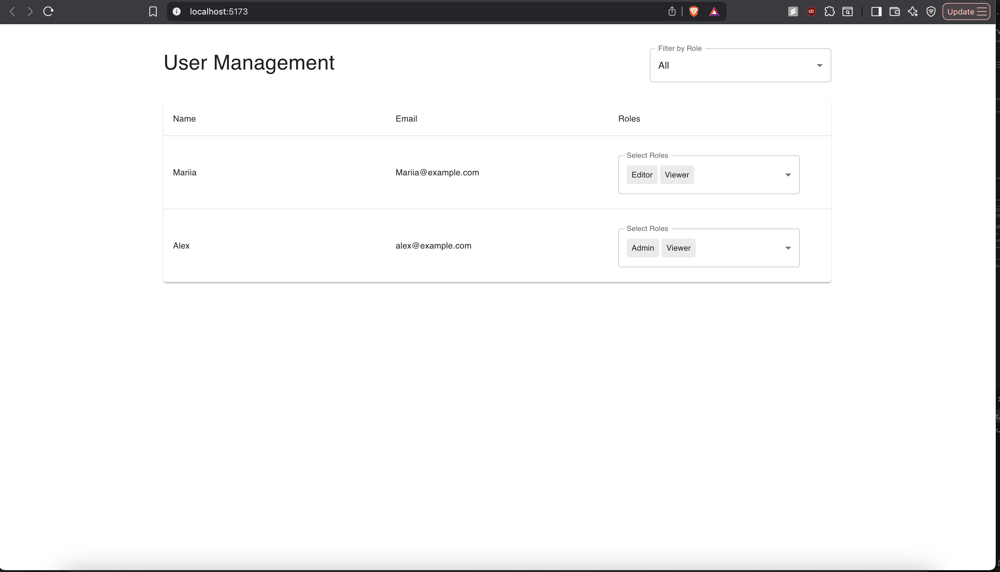
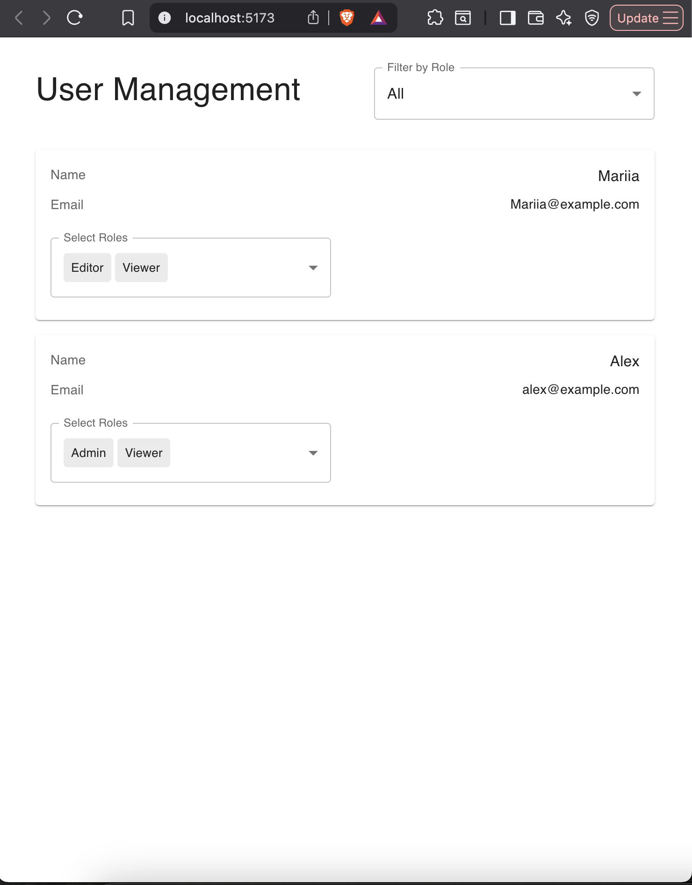

# Admin Dashboard - User Role Management

This project is a small web application built to view and manage user roles in a system. It features a React frontend with Material-UI and a simple Express backend for API simulation.

## Screenshot

### Desktop View



### Mobile View



---

## Features

- **View Users**: Displays a list of users with their name, email, and currently assigned roles.
- **Manage Roles**: Allows an admin to add or remove multiple roles for any user via a multi-select dropdown.
- **Role-Based Filtering**: Lets users filter the list by specific roles.
- **Responsive Design**: The traditional table layout seamlessly transforms into a user-friendly card view on mobile devices.
- **Loading & Error States**: Handles fetching and API errors gracefully.

---

## Tech Stack

- **Frontend**:

  - React
  - TypeScript
  - Vite
  - Material-UI (MUI) for the component library
  - Native `fetch` for API requests

- **Backend**:
  - Node.js
  - Express.js
  - TypeScript
  - Data is persisted in a simple `db.json` file to simulate a database.

---

## Project Setup & Running Instructions

This project is structured as a monorepo with two main folders: `frontend` and `backend`. You will need to run both applications concurrently in separate terminal windows.

### Prerequisites

- Node.js 18+
- PostgreSQL 14+

## Backend Setup

The backend is a simple Express server with PostgreSQL that simulates the required API endpoints.

```bash
# 1. Navigate to the backend directory
cd backend

# 2. Install dependencies
npm install
```

### PostgreSQL Setup (macOS / Linux / Windows)

#### macOS / Linux

Open terminal and log in to PostgreSQL:

```bash
psql -U <your-username> -d postgres
```

Then run inside `psql`:

```bash
# Create database
CREATE DATABASE admin_dashboard;
```

Run the script which creates needed tables with pre-defined data:

```bash
psql -U <username> -d admin_dashboard -f "C:\path\to\init.sql"
```

Use double quotes around paths if they contain spaces.

#### Windows

Open terminal and log in to PostgreSQL:

```bash
psql -U <username> -d postgres
```

If psql is not recognized, add PostgreSQL bin folder to your system PATH, e.g. C:\Program Files\PostgreSQL\14\bin

Then run inside `psql`:

```bash
# Create database
CREATE DATABASE admin_dashboard;
```

Run the script which creates needed tables with pre-defined data:

```bash
psql -U <your-username> -d admin_dashboard -f init.sql
```

### Configure environment variables

Create a `.env` file in the backend folder:

```bash
DATABASE_URL=postgresql://<username>@localhost:5432/admin_dashboard
PORT=4000
```

Replace <username> with your PostgreSQL username.

### Start the backend server

```bash
npm run dev
```

The backend API will be running at [http://localhost:4000](http://localhost:4000) (or the next available port).

## Frontend Setup

Next, in a new terminal window, set up and run the frontend application.

```bash
# Navigate to the frontend directory
cd frontend

# Install dependencies
npm install

# Start the development server
npm start
```

The application will be available at [http://localhost:5173](http://localhost:5173) (or the next available port).

### API Simulation & Authorization

The task requirements state that only an admin should be able to change user roles.

To keep the backend simple and aligned with its purpose as a data simulator for the frontend, this project intentionally **does not implement a full authentication or authorization system** (e.g., login, JWTs). Doing so would be over-engineering for this assignment, which has a stated focus on the frontend.

The backend's `PATCH /users/:id/roles` endpoint is therefore open and implicitly assumes that any request it receives is from an authorized admin user. This decision keeps the project's focus on the primary objective: **the frontend architecture, component design, and user experience**.

## Assumptions & Trade-offs

### 1. Authentication & Access Control

The route that handles user role updates is protected and accessible only by admins. On the frontend, I use a hardcoded token to simulate this process. This demonstrates awareness of role-based access control without implementing a full authentication system, keeping the task within the requirements.

### 2. Role Behavior

- Each user has a default role of `Viewer`; removing all roles is not allowed.
- The list of roles is fixed (`Admin`, `Editor`, `Viewer`).

### 3. Updating Roles Behavior

Role changes take effect immediately when a user selects/deselects a role in the dropdown. This simplifies the UX for the assignment while still demonstrating role management.

### 4. Persistence

Data is stored in a simple PostgreSQL implementation to simulate a real backend database.

### 5. Error Handling & UX

- Updates show error notifications as simple text if they are catched.
- Loading indicators are displayed while fetching data.

### 6. Testing

Automated tests are not included to keep the task within scope. In a production environment, unit and integration tests would be implemented.

### 7. Responsiveness & Accessibility

The UI is responsive and partially accessible thanks to Material UI components. No additional accessibility features were implemented to keep the implementation simple.
